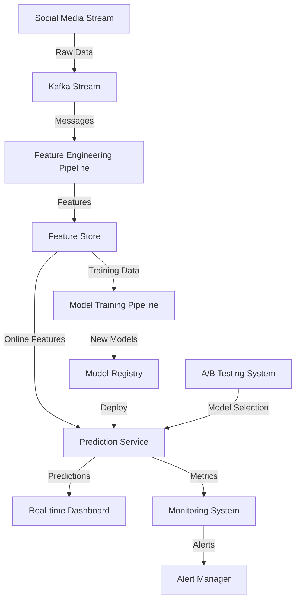

# Real-Time Social Media Sentiment Analysis System

[](https://www.python.org)
[](https://mlflow.org)
[](https://fastapi.tiangolo.com)
[](https://pytorch.org)
[](LICENSE)

## 🎯 Overview

A production-grade MLOps project that performs real-time sentiment analysis on social media data. The system processes streaming data, automatically retrains on new data, and provides comprehensive monitoring and A/B testing capabilities.

### Key Features

- 🔄 Real-time data processing pipeline
- 🎯 Automated model training and deployment
- 📊 Real-time analytics dashboard
- 🧪 A/B testing framework
- 📈 Comprehensive monitoring system
- ⚡ High-performance prediction API
- 🔄 Automated retraining pipeline

## 🏗️ System Architecture



## 🛠️ Technical Stack

### Data Engineering
- Apache Kafka
- Apache Spark
- MongoDB
- Feast Feature Store

### Machine Learning
- PyTorch
- MLflow
- DVC
- Kubeflow

### Deployment
- FastAPI
- Redis
- Docker
- Kubernetes

### Monitoring
- Prometheus
- Grafana
- ELK Stack
- Great Expectations

## 🚀 Getting Started

### Prerequisites

```bash
# Clone the repository
git clone https://github.com/VenkateshRoshan/Real-Time-Social-Media-Sentiment-Analysis-System.git
cd Real-Time-Social-Media-Sentiment-Analysis-System

# Create virtual environment
python -m venv venv
source venv/bin/activate  # On Windows: venv\Scripts\activate

# Install dependencies
pip install -r requirements.txt
```

### Configuration

1. Create `.env` file:
```env
KAFKA_BOOTSTRAP_SERVERS=localhost:9092
MONGODB_URI=mongodb://localhost:27017
REDIS_HOST=localhost
REDIS_PORT=6379
MODEL_REGISTRY_URI=http://localhost:5000
```

2. Configure social media API credentials in `config/credentials.yaml`:
```yaml
twitter:
  api_key: your_api_key
  api_secret: your_api_secret
  bearer_token: your_bearer_token
```

### Running the System

1. Start Infrastructure:
```bash
docker-compose up -d
```

2. Start Data Pipeline:
```bash
python src/ingestion/stream_processor.py
```

3. Launch API:
```bash
uvicorn src/serving/api:app --host 0.0.0.0 --port 8000
```

4. Access Dashboard:
```
http://localhost:3000
```

## 📁 Project Structure

```
social-media-sentiment/
├── config/                 # Configuration files
├── data/                  # Data storage
│   ├── raw/              # Raw data
│   └── processed/        # Processed data
├── models/               # Model artifacts
├── notebooks/           # Jupyter notebooks
├── src/                 # Source code
│   ├── ingestion/      # Data ingestion
│   ├── features/       # Feature engineering
│   ├── training/       # Model training
│   ├── serving/        # Model serving
│   ├── monitoring/     # Monitoring
│   └── experiments/    # A/B testing
├── tests/              # Unit tests
├── docker-compose.yml  # Docker composition
└── requirements.txt    # Dependencies
```

## 🔧 Development

### Running Tests

```bash
# Run all tests
pytest

# Run specific test file
pytest tests/test_model.py

# Run with coverage
pytest --cov=src tests/
```

### Code Style

```bash
# Format code
black src/

# Check linting
flake8 src/

# Type checking
mypy src/
```

## 📊 Monitoring

### Metrics Dashboard

Access Grafana dashboard at `http://localhost:3000`:
- Model performance metrics
- System health metrics
- Data quality metrics
- A/B testing results

### Alerts

Configure alerts in `config/alerts.yaml`:
```yaml
alerts:
  - name: model_drift
    condition: drift_score > 0.7
    channels: 
      - slack
      - email
```

## 🧪 A/B Testing

Configure experiments in `config/experiments.yaml`:
```yaml
experiments:
  model_comparison:
    variants:
      - name: baseline
        weight: 0.5
      - name: experimental
        weight: 0.5
    metrics:
      - accuracy
      - latency
```

## 📈 Performance

### Benchmarks

- Throughput: 1000 predictions/second
- Latency: p95 < 100ms
- Model Accuracy: 85%+
- Data Processing: Real-time

### Scaling

The system can be scaled by:
- Adding Kafka partitions
- Scaling Kubernetes pods
- Implementing horizontal pod autoscaling
- Adding Redis clusters

## 🤝 Contributing

1. Fork the repository
2. Create feature branch
3. Commit changes
4. Push to branch
5. Create pull request

## 🚧 Roadmap

- [ ] Multi-language support
- [ ] Automated model optimization
- [ ] Enhanced visualization dashboard
- [ ] Extended API capabilities
- [ ] Advanced anomaly detection

## 📧 Contact

For issues and support:
- Create an [Issue](https://github.com/yourusername/social-media-sentiment/issues)
- Email: butchivenkatesh.a@gmail.com
